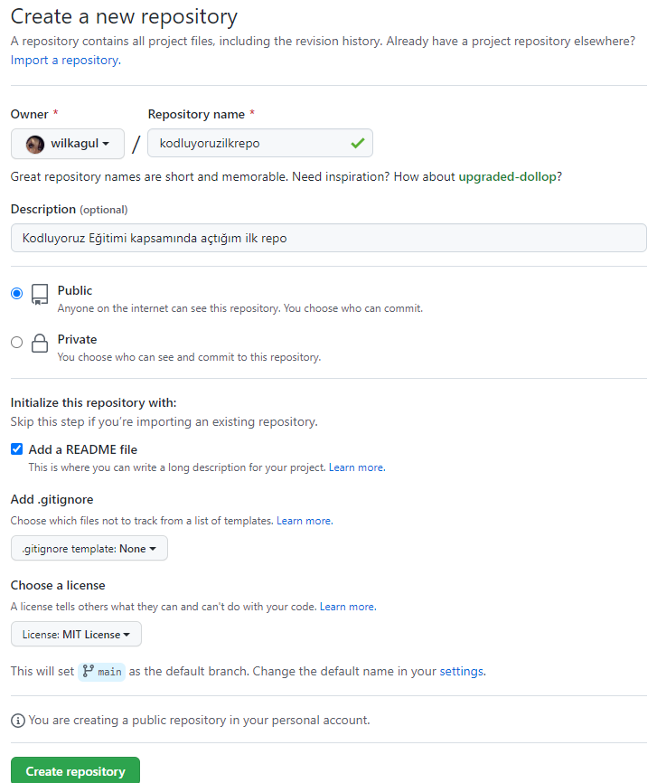

# Kodluyoruz İlk Repo
Bu repo kodluyoruz Front-End eğitiminde oluşturduğumuz ilk repo içerisinde bir adet README dosyası, bir adet de index.html barındırıyor.

## Installation
Öncelikle projeyi clonlayın.(Buraya sizin reponuzdan aldığımız linkk gelecek)
```
git clone https://github.com/wilkagul/-kodluyoruzilkrepo.git
```
## Usage
Projeyi cloneladıktan sonra Visual Studıo Code programında açınız.
Linux için:
```
cd kodluyoruzilkrepo
code .
```
## Contributing
Pull requestler kabul edilir.Büyük değişiklikler için, lütfen önce neyi değiştirmek istediğinizi tartışmak için bir konu açnız.
## License
[MIT](https://google.com)

